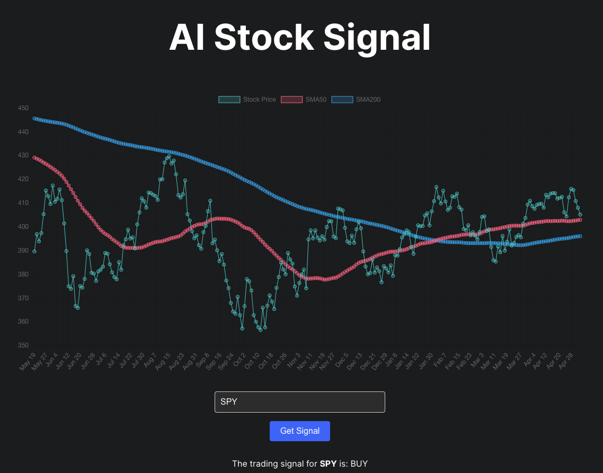

# AI Stock Signal

AI Stock Signal is a single-page web application that displays buy or sell signals for stocks based on their historical price data. The project is developed with the help of GPT-4, an advanced language model by OpenAI.



## Features

- User-friendly interface
- Input any stock ticker to get a buy or sell signal
- Powered by GPT-4, which provides assistance throughout the development process

## Getting Started

To set up the project locally, follow these steps:

1. Clone the repository:

```sh
git clone https://github.com/bsheairs/stocksignal.git
```

2. Install dependencies:

```sh
cd ai-stock-signal
npm install
```

3. Set up the environment variables by creating a .env.local file in the root of the project and adding the following line:

```sh
REACT_APP_ALPHA_VANTAGE_API_KEY=your_alpha_vantage_api_key
```

4. Start the development server:

```sh
npm start
```

5. Open your browser and visit http://localhost:3000.

## Powered by GPT-4

AI Stock Signal's development is powered by GPT-4, an advanced language model by OpenAI. Throughout the development process, GPT-4 has provided assistance, such as:

## Answering questions related to the project

Suggesting code snippets and improvements
Guiding the creation of unit tests and CI/CD pipelines
Offering design suggestions and improvements
By leveraging GPT-4's capabilities, the development process becomes more efficient and streamlined.

## Contributing

Feel free to open issues or submit pull requests to contribute to the project. Your contributions are more than welcome!

## License

This project is licensed under the MIT License - see the LICENSE file for details.
